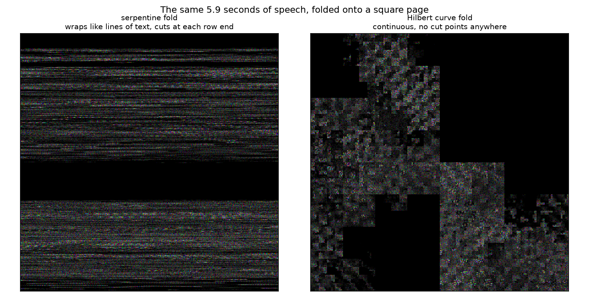
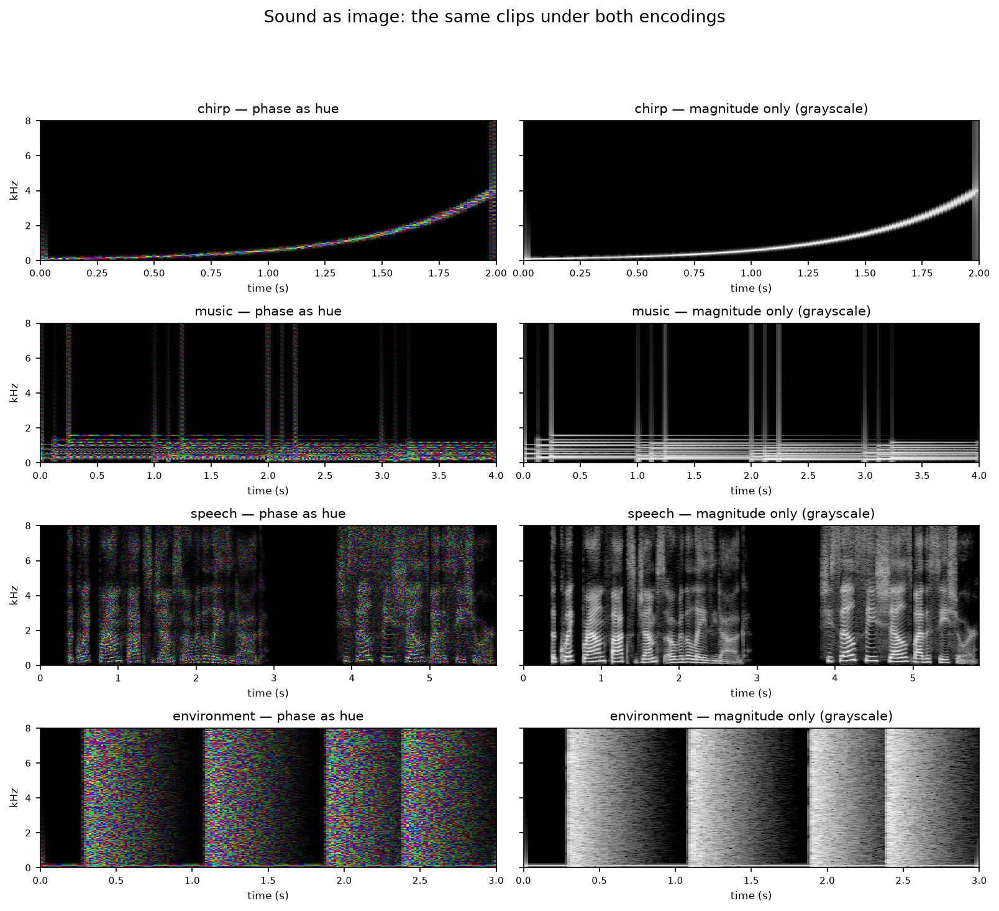
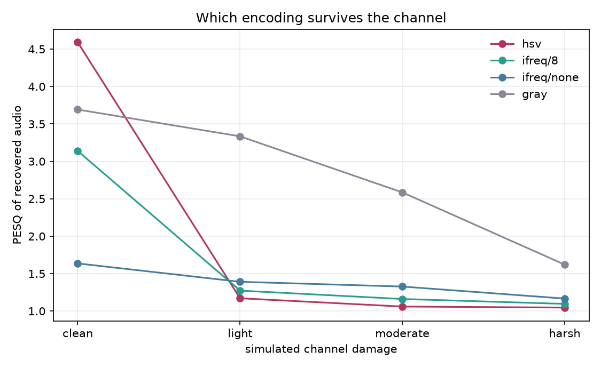
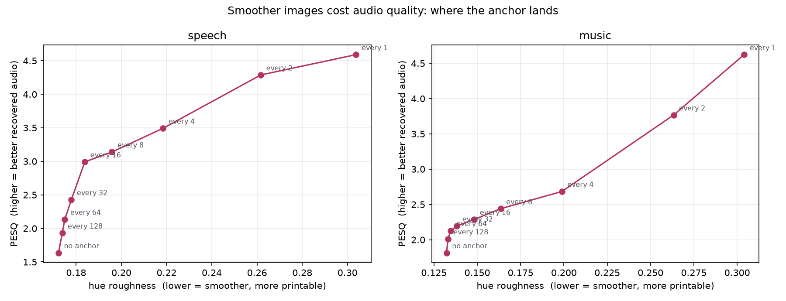
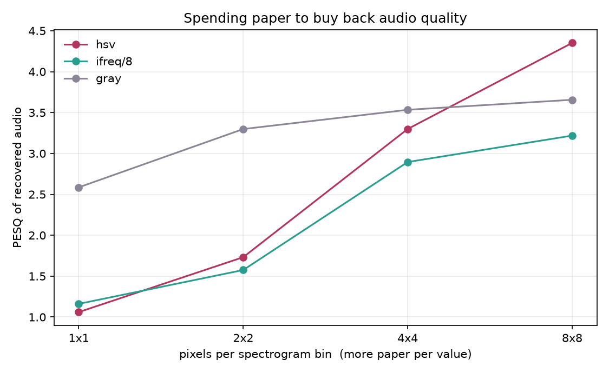

# Visualize Sound

A sound clip is a one-dimensional signal — one long list of amplitude values
over time. An image is a two-dimensional grid of color. This project turns one
into the other in a mathematically principled way (no arbitrary cut points),
folds the result into a genuine square picture rather than a timeline strip,
and measures how much of the original sound survives being printed on paper
and photographed back.

Route A of a larger research plan: **can a phase-aware color encoding of sound
survive the physical print–scan channel, and which design choices help it
survive best?** Full research dossier (prior art, positioning, experiment
plan, and the same figures below with **playable audio clips** next to each
one) lives in [`artifacts/visualize-sound.html`](artifacts/visualize-sound.html)
— open it in a browser, or view it hosted at the [research
artifact](https://claude.ai/code/artifact/b747f5da-79ea-4b26-9629-00100ed4c122)
link. Static images only render here; this README documents the code. There's
also a live, in-browser [interactive lab](web/) (Next.js, deploys to Vercel as
a single static bundle, no backend) for trying different clips, schemes, and
damage levels yourself and hearing the result immediately. Every
source cited is listed in [`artifacts/references.md`](artifacts/references.md).

## How it works

**1. Sound to matrix — the Short-Time Fourier Transform.** A window slides
along the waveform; each windowed slice gets a Fourier transform; the results
stack into a complex matrix `X[f, t]` — one row per frequency, one column per
moment in time. This is the principled 1D→2D conversion: both axes are
physical, the frequency/time trade-off follows a known law, and the transform
is exactly invertible. See [`vsound/stft.py`](vsound/stft.py).

**2. Matrix to color — phase as hue.** Each cell of `X` is a complex number
carrying magnitude (loudness) and phase (where in its cycle the wave sits).
Phase is circular, 0° = 360°, so it maps naturally onto hue, a circular color
dimension. Magnitude maps to brightness on a dB scale. Three encodings are
implemented and compared:

| scheme | hue carries | decode |
| --- | --- | --- |
| `hsv` | raw phase | direct inverse |
| `ifreq` | phase advance relative to a steady tone, re-anchored every N columns | integrate, then inverse |
| `gray` | nothing — magnitude only | Griffin-Lim phase estimation |

See [`vsound/codec.py`](vsound/codec.py).

**3. Strip to square — a Hilbert curve.** A spectrogram's second axis is still
time, so encoding it directly produces a long thin strip, indistinguishable
from any ordinary spectrogram viewer. To get a genuine square matrix, the
sequence of spectrogram cells is folded onto a page along a Hilbert
space-filling curve: it visits every cell of a square exactly once, never
jumps, and keeps sequence-neighbors physically adjacent no matter where they
fall in the recording. A simpler serpentine (text-wrap) fold is included for
comparison. Both are lossless permutations. See
[`vsound/layout.py`](vsound/layout.py).

**4. The channel — simulated print and capture.** Ink spread (blur), chroma
subsampling (fine color detail lost before fine brightness detail), a printed
tone curve, and camera sensor noise, applied in that order. A stand-in for a
real printer and camera, used to steer which encoding choices are worth
testing physically. See [`vsound/channel.py`](vsound/channel.py).

**5. Metrics.** SNR, log-spectral distance, STOI (intelligibility), PESQ
(perceptual quality), and a custom hue-roughness metric measuring how violently
color changes between neighboring pixels — a proxy for how badly an image will
survive halftoning and camera blur. See [`vsound/metrics.py`](vsound/metrics.py).

## Setup

```bash
python3 -m venv .venv
.venv/bin/pip install numpy scipy soundfile pillow matplotlib pystoi pesq
```

## Running

```bash
.venv/bin/python scripts/make_samples.py     # write the test clips (speech, music, noise, chirp)
.venv/bin/python scripts/e0_baseline.py      # E0: digital round trip, all schemes
.venv/bin/python scripts/e0_anchor_sweep.py  # E0b: smoothness vs drift trade-off
.venv/bin/python scripts/e1_sim.py           # E1: simulated print and capture
.venv/bin/python scripts/e1_blocks.py        # E1b: pixels per bin vs quality (the crossover)
.venv/bin/python scripts/e2_square.py        # E2: strip vs square (serpentine, Hilbert) layouts
.venv/bin/python scripts/figure_gallery.py   # renders the comparison figure below
```

Images, decoded `.wav` files, and figures land in `out/` (gitignored,
regenerate any time with the commands above). The figures shown below are
copied into `assets/figures/`, which is tracked, so they render on GitHub.

## Results

> Static images below; open
> [`artifacts/visualize-sound.html`](artifacts/visualize-sound.html) locally
> (or the same page [hosted
> here](https://claude.ai/code/artifact/b747f5da-79ea-4b26-9629-00100ed4c122))
> for the same figures with the actual audio clips playable next to them —
> original vs. recovered, digital vs. after simulated print damage.

### The strip problem, fixed

The first working version encoded sound the same way every audio editor
already does — a strip, not a matrix. The fix is a Hilbert curve fold:



Both layouts decode to bit-identical audio (PESQ 4.59, matching the strip
layout exactly) — a layout permutes cells, it doesn't discard any. What
differs is how damage spreads across the page, which the physical print test
will probe directly.

### What the encodings look like



Raw phase-as-hue is information-complete but reads as color speckle rather
than a legible pattern — correct, but a poor human-viewing encoding and,
as the next result shows, fragile under printing.

### Phase collapses first in the channel

Digitally, phase-as-hue is close to transparent (PESQ 4.59 vs. 3.69 for
magnitude-only). Push the same images through the simulated channel at one
spectrogram bin per pixel and the result inverts completely:



Fine hue detail is the first casualty of ink spread and chroma subsampling. A
standard phase-vocoder fix (encoding phase as a smooth frame-to-frame
deviation instead of its raw value) measurably smooths the image but doesn't
rescue quality, because the decoder must integrate the deviations and small
errors accumulate forward through time:



### The crossover

The comparison above used the most fragile arrangement possible — one bin per
pixel. Giving each bin a block of several pixels (the way barcodes buy
robustness) produces a clean, quantified crossover:



Grayscale plateaus near PESQ 3.7 regardless of resolution — guessed phase is
its hard ceiling. Phase-carrying color keeps climbing toward the digital
numbers above it once given enough paper per value. Below roughly 4 pixels per
bin, discarding phase is the right call; above it, keeping phase wins. This
explains, quantitatively, why every existing printed-audio system went
grayscale, and identifies where that choice stops being correct. The price is
capacity: at 300 dpi on A4, roughly four minutes of audio per page at 1×1
falls to about ten seconds at 4×4, before any error-correction overhead.

**All of the above is simulated channel damage, not a real printer and
camera.** It's a hypothesis about paper, generated by code that can now be
pointed at a real print-and-scan test to check it. That run hasn't happened
yet.

## Project layout

```
vsound/
  stft.py       forward/inverse Short-Time Fourier Transform, Griffin-Lim
  codec.py      HSV / instantaneous-frequency / grayscale image encode-decode
  layout.py     Hilbert curve and serpentine square folding
  channel.py    simulated print-and-capture distortion
  metrics.py    SNR, log-spectral distance, STOI, PESQ, hue roughness
scripts/
  make_samples.py      generates the test clips
  e0_baseline.py        digital round-trip comparison
  e0_anchor_sweep.py     phase re-anchoring trade-off
  e1_sim.py              simulated channel, damage-level sweep
  e1_blocks.py            simulated channel, pixels-per-bin sweep (the crossover)
  e2_square.py            strip vs. serpentine vs. Hilbert layout
  figure_gallery.py       renders the encoding comparison figure
samples/     generated test audio (gitignored)
out/         generated images, decoded audio, figures (gitignored)
assets/figures/  tracked copies of the figures shown in this README
```

## Credits and sources

Full annotated list, with what each source specifically contributed to this
project's direction: [`artifacts/references.md`](artifacts/references.md).

**Libraries.** [NumPy](https://numpy.org/) and [SciPy](https://scipy.org/) for
array math and the Gaussian/zoom filters in the channel simulation;
[SoundFile](https://python-soundfile.readthedocs.io/) for WAV I/O;
[Pillow](https://python-pillow.org/) for PNG encode/decode;
[Matplotlib](https://matplotlib.org/) for HSV↔RGB conversion and every figure
in this document; [pystoi](https://github.com/mpariente/pystoi) for the STOI
intelligibility metric; [PESQ](https://github.com/ludlows/PESQ) (ITU-T P.862)
for the perceptual quality metric. The speech sample is synthesized locally
with macOS `say`.

**Prior art and inspiration**, found during the research pass that shaped
this project's direction:

- Nathaniel Newhouse, ["Log complex color for visual pattern recognition of
  total sound"](https://image-ppubs.uspto.gov/dirsearch-public/print/downloadPdf/10341795),
  US Patent 10,341,795 (2019) — the digital prior art for phase-as-hue,
  amplitude-as-brightness encoding, and the claim of full reversibility that
  this project reproduces and then tests under printing.
- ["Phase representation based on HSV color model for acoustic classification
  with CNNs"](https://ieeexplore.ieee.org/document/9621891/), IEEE (2021) —
  phase-to-HSV encoding for classifier pipelines.
- Alexander Zolotov, [PhonoPaper](https://warmplace.ru/soft/phonopaper/)
  (2014) — the closest existing system to Route A: a grayscale spectrogram
  printed on paper and resynthesized live from a phone camera. The primary
  baseline this project's grayscale scheme is measured against.
- Matthew Tancik et al., ["StegaStamp: Invisible Hyperlinks in Physical
  Photographs"](https://arxiv.org/abs/1904.05343), CVPR (2019) — evidence that
  the print–scan channel is a serious, citable research problem, and the
  inspiration for treating channel robustness as a first-class design
  variable rather than an afterthought.
- ["High Capacity Color Barcodes: Per Channel Data Encoding via Orientation
  Modulation in Elliptical Dot Arrays"](https://ieeexplore.ieee.org/document/5635329/),
  IEEE TIP (2011) — capacity baselines for paper as a data medium, and the
  source of the "spend more pixels per value" idea behind the block-size
  crossover experiment.
- ["Saving the Sonorine: Photovisual Audio Recovery Using Image Processing and
  Computer Vision Techniques"](https://arxiv.org/pdf/2005.08944), arXiv (2020)
  — precedent that recovering audio from physical media via imaging is a
  publishable line of research.
- ["Audio-to-Image Encoding for Improved Voice Characteristic Detection Using
  Deep Convolutional Neural Networks"](https://arxiv.org/pdf/2503.05929),
  arXiv (2025) — recent RGB-channel audio encoding schemes.
- ["Single channel speech enhancement by colored
  spectrograms"](https://arxiv.org/pdf/2310.17142), arXiv (2023) — colored
  spectrograms used inside an enhancement pipeline.
- Barry Blesser / Kodak-era printed-audio patents, e.g.
  [US 8,934,032](https://image-ppubs.uspto.gov/dirsearch-public/print/downloadPdf/8934032)
  "Printed audio format and photograph with encoded audio" — historical
  context for encoding audio bitstreams into printed photographs.
- ["SemantiCodec: An Ultra Low Bitrate Semantic Audio
  Codec"](https://arxiv.org/pdf/2405.00233), arXiv (2024) — the enabling
  result for the parked "Route B" (neural-codec-bits-in-a-barcode) comparison
  discussed but not built here.

The full literature review, gap analysis, and experiment plan behind this
code live in the project's published research artifact.
